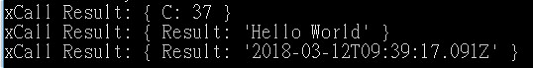

# How to develop Microservices?

**ENVIRONMENT**

_Node.js_

* **Step A** 
  * Install _Node.js_  


    > https://nodejs.org/en/

    Download and install under _C:\nodejs_  

  * Testing the installation  


    Open _&lt;Cmd&gt;_ and test if the installation was successful  


    ```javascript
    node -v  // shows the version of node
    ```
* **Step B**
  * Open _&lt;Cmd&gt;_ and specify the path to the Node.js summary 
  * Create a folder under C:\nodejs ; name it 'project' _mkdir C:\nodejs\project_ 
  * _cd C:\nodejs\project_

    ```javascript
    npm init //initialize node package manager
    ```

    Press _'enter'_ until finished with all the arguments

    ```javascript
    npm install motebus --save //install MoteBus
    npm install express --save //install express
    ```
* **Step C**
  * Install _MoteBus SDK_
    * _MoteBusHelloWorld_ Download link

      > http://www.ypcloud.com/download/motebushelloworld.zip

    * Unzip to extract the _HelloWorld_ folder and copy to _C: \nodejs\project_ 
    * Run C:\nodejs\project\HelloWorld\bin\MoteBus\_win32.exe as an _Administrator,_ ensuring that TCP port _6788_ is open in the system's firewall 
  * Run _HelloWorld.js_

    _cd C:\nodejs\project\HelloWorld_

    ```javascript
    node index.js  //runs index.js
    ```
* **Step D**
  * _Local Host_ test

    _cd C:\nodejs\project\HelloWorld\test\_

    ```javascript
    node MoteTest.js
    ```

      

  * _Client Server_ test
    * _Use a code editor to open \_MoteTest.js_ and modify the _third_ statement of the js file
    * Find & replace _'127.0.0.1'_ with _'192.168.10.185'_

_MoteTest.js_ is a test program for testing the _Motebus_ connector which returns the test results for _Add\(\), Echo\(\) & Time \(\)_ functions

